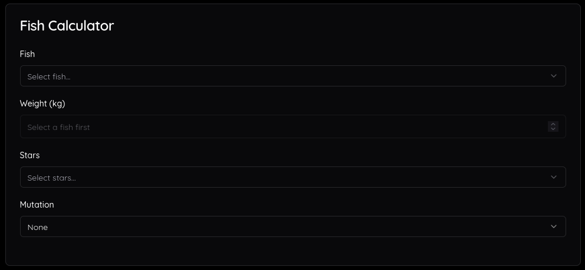
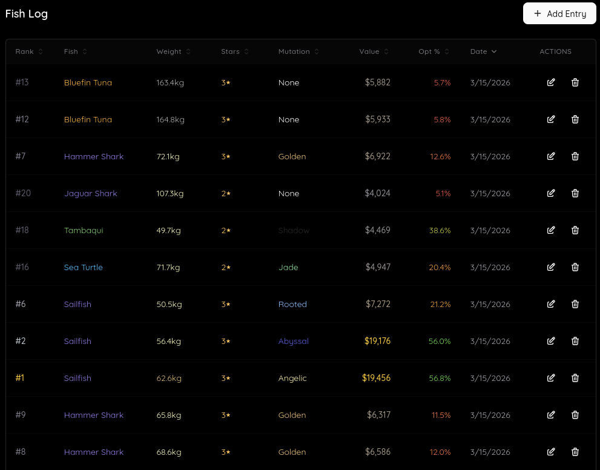
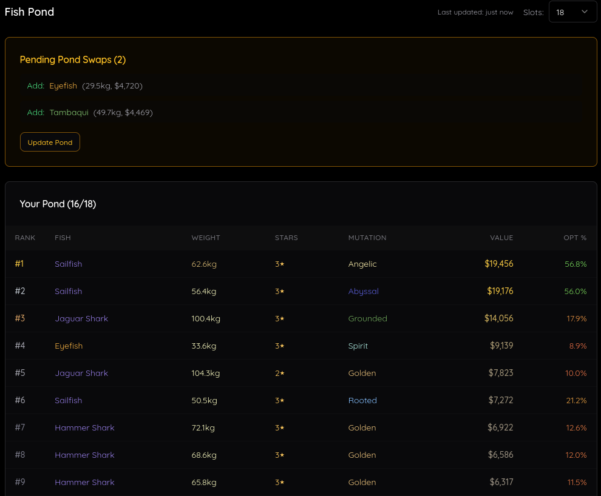

# Abyss Fish Tracker

   

Abyys Fish Tracker is a free tool for managing your fish pond in [Abyss](https://www.roblox.com/games/127794225497302/Abyss). Figure out exactly what your fish are worth, keep track of your best, and know which fish to swap in and out of your pond.

**Use Abyss Fish Tracker → https://abyss-fish-tracker.abran.dev**

### Calculator

Calculate any fish's value instantly.

### Fish Log

Track all your catches — sorted, ranked, and saved to your account.

### Fish Pond

Manage your pond lineup and figure out the best swaps.

*Your email is only used for authentication and will never be shared with third parties.*

## Roadmap

1. Switch to Discord login instead of email
2. Share your pond with friends via a public link
3. Like other players' ponds
4. Leaderboards (maybe)
    - Most liked ponds
    - Most valuable ponds
    - Most legendary fish
    - Most valuable fish
    - Etc.